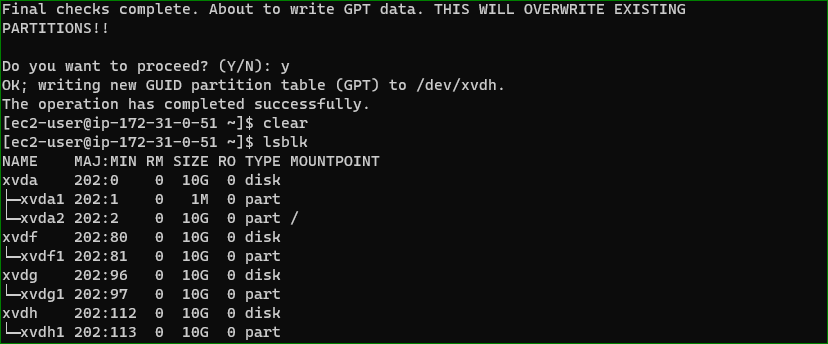
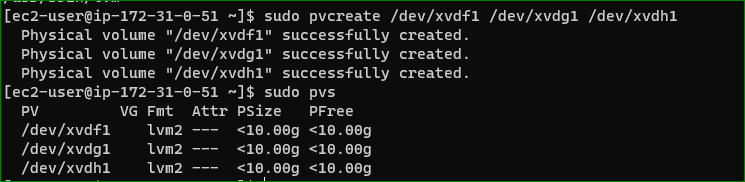
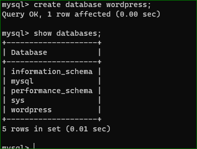
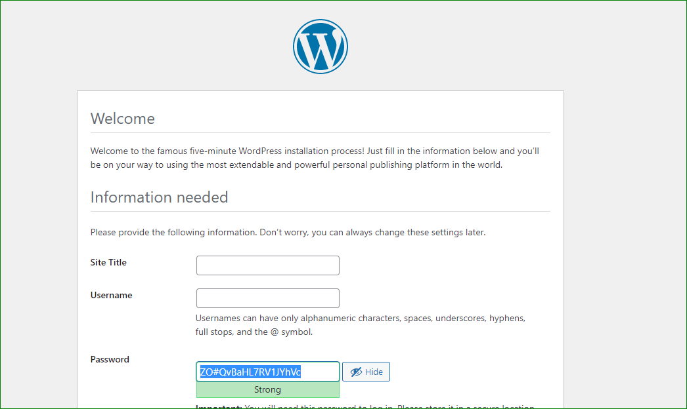
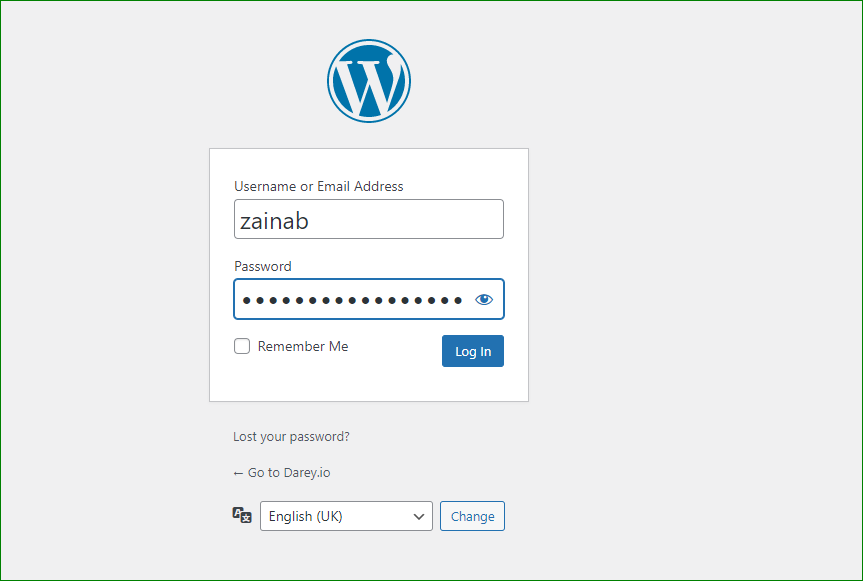
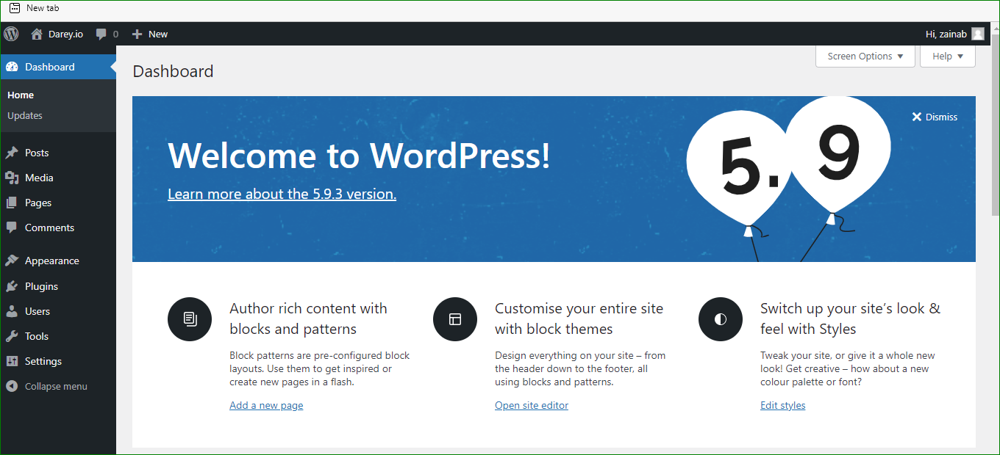

##DOCUMENTION OF PROJECT 6 

`lsblk`

`sudo gdisk /dev/xvdf`

`sudo gdisk /dev/xvdg`

`sudo gdisk /dev/xvdh`

`lsblk`

`sudo yum install lvm2`

`sudo pvcreate /dev/xvdf1`

`sudo pvcreate /dev/xvdg1`

`sudo pvcreate /dev/xvdh1`

`sudo vgcreate webdata-vg /dev/xvdh1 /dev/xvdg1 /dev/xvdf1`

`sudo lvcreate -n app-lv -L 14G webdata-vg`

`sudo lvcreate -n logs-lv -L 14G webdata-vg`

`sudo mkfs -t ext4 /dev/webdata-vg/app-lv`

`sudo mkfs -t ext4 /dev/webdata-vg/logs-lv`

`sudo mkdir -p /var/www/html`

`sudo mkdir -p /home/recovery/logs`

`sudo mount /dev/webdata-vg/app-lv /var/www/html/`

`sudo rsync -av /var/log/. /home/recovery/logs/`

`sudo mount /dev/webdata-vg/logs-lv /var/log`

`sudo rsync -av /home/recovery/logs/. /var/log`

`sudo vi /etc/fstab`

`sudo systemctl daemon-reload`

`sudo gdisk /dev/xvdf`

`sudo gdisk /dev/xvdg`

`sudo gdisk /dev/xvdh`

`sudo pvcreate /dev/xvdf1`

`sudo pvcreate /dev/xvdg1`

`sudo pvcreate /dev/xvdh1`

`sudo vgcreate database-vg /dev/xvdf1 /dev/xvdg1 /dev/xvdh1`

`sudo lvcreate -n db-lv -L 20G database-vg`

`sudo mkdir -p /db`

`sudo mkfs -t ext4 /dev/database-vg/db-lv`

`sudo mount /dev/database-vg/db-lv /db`

`sudo vi /etc/fstab`

`sudo mount -a`

`sudo systemctl daemon-reload`

`sudo yum -y update`

`sudo yum install https://dl.fedoraproject.org/pub/epel/epel-release-latest-8.noarch.rpm`

`sudo yum install yum-utils http://rpms.remirepo.net/enterprise/remi-release-8.rpm`

`sudo yum -y install wget httpd php php-mysqlnd php-fpm php-json`

`sudo yum module list php`

`sudo yum module reset php`

`sudo yum module enable php:remi-7.4`

`sudo yum install php php-opcache php-gd php-curl php-mysqlnd`

`sudo systemctl start php-fpm`

`sudo systemctl enable php-fpm`

`setsebool -P httpd_execmem 1`

`sudo systemctl enable httpd`

`sudo systemctl start httpd`

`sudo systemctl restart httpd`

`mkdir wordpress`

  `cd   wordpress`

  `sudo wget http://wordpress.org/latest.tar.gz`

  `sudo tar xzvf latest.tar.gz`

  `sudo rm -rf latest.tar.gz`

  `cp wordpress/wp-config-sample.php wordpress/wp-config.php`

  `cp -R wordpress /var/www/html/`

`sudo chown -R apache:apache /var/www/html/wordpress`

 `sudo chcon -t httpd_sys_rw_content_t /var/www/html/wordpress -R`

`sudo setsebool -P httpd_can_network_connect=1`

`sudo yum update`

`sudo yum install mysql-server`

`sudo systemctl restart mysqld`

`sudo systemctl enable mysqld`

`sudo yum install mysql`

`sudo` mysql -u admin -p -h <DB-Server-Private-IP-address>`

`SHOW DATABASES`

